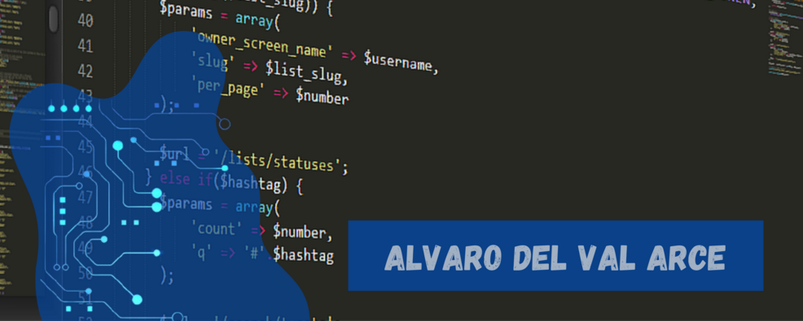

##  ✨ Bienvenido, soy Álvaro Del Val Arce ✨ 

Soy un joven entusiasta de la informatica que está empezando en el mundillo del desarrollo de software y la programación 🤓.

Actualmente acabo de terminar mis estudios y ya soy un Técnico superior en Desarrollo de Aplicaciones Multiplataforma (DAM) y he sido formado en  **[IES LUIS VIVES]** en Leganes, Madrid.

[IES LUIS VIVES]: https://www.iesluisvives.es/

Este es mi **repositorio personal** donde estaré subiendo mis proyectos a lo largo de mi evolución en el mundo de la programación y el desarrollo de software.

Cuando no estoy aprendiendo me encargo de malgastar mi tiempo en el mundo de los videojuegos 🎮, la lectura 📘 y el cine 🎬.

